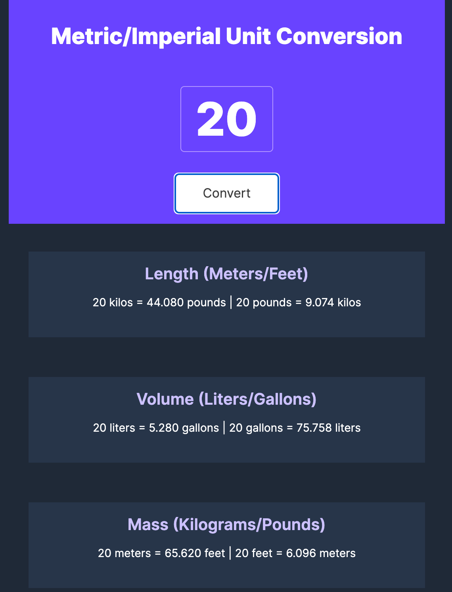

# Unit-Conversion

[Unit Conversion - Screenshot](./images/unit-converter.png)
[Unit Conversion - Screenshot](./images/unit-converter.png)

For this project, you can enter a value into the input and get all the conversions of Length, Volume and Mass.

This project came from the Scrimba [Frontend Career Path](https://scrimba.com/learn/frontend)

